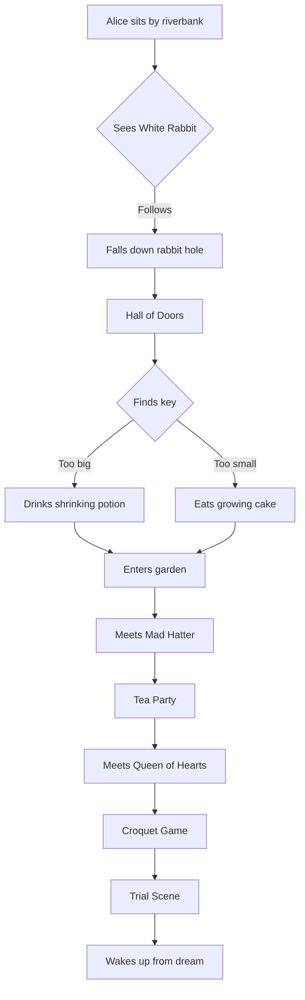
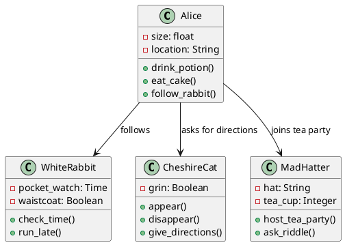

# 🎩 MiaoYan Markdown Syntax Guide

*A journey through wonderland with comprehensive markdown examples*

---

## Table of Contents

- [Headers](#headers)
- [Text Formatting](#text-formatting)
- [Lists](#lists)
- [Links and Images](#links-and-images)
- [Tables](#tables)
- [Code](#code)
- [Math and Formulas](#math-and-formulas)
- [Diagrams (Mermaid, PlantUML, Markmap)](#diagrams)
- [Blockquotes](#blockquotes)
- [Task Lists](#task-lists)
- [Footnotes](#footnotes)
- [Horizontal Rules](#horizontal-rules)

---

## Headers

# Chapter 1: Down the Rabbit-Hole

## Alice was beginning to get very tired

### of sitting by her sister on the bank

#### and of having nothing to do

##### once or twice she had peeped into the book

###### her sister was reading, but it had no pictures

---

## Text Formatting

**Alice** was beginning to get very tired of sitting by her *sister* on the bank, and of having ***nothing*** to do: once or twice she had peeped into the book her sister was reading, but it had no pictures or conversations in it.

~~She thought~~ "And what is the use of a book," thought Alice "without pictures or conversation?"

Suddenly a White Rabbit with pink eyes ran close by her.

Alice found herself falling down a `very deep well`.

H~2~O is what Alice might have encountered in her adventures.

The tea party happened on the 26^th^ day of the month.

---

## Lists

### What Alice saw in Wonderland

- **Characters she met:**
  - The White Rabbit 🐰
  - The Cheshire Cat 😸
  - The Mad Hatter 🎩
    - Who loved tea parties
    - Always spoke in riddles
  - The Queen of Hearts ♥️
  - The Caterpillar 🐛

### Alice's adventures (ordered)

1. **Falling down the rabbit hole**
   1. Seeing strange things on the walls
   2. Landing in a heap of sticks and dry leaves
2. **Finding the key and the door**
3. **Growing and shrinking**
   - Eating cake marked "EAT ME"
   - Drinking from bottle labeled "DRINK ME"
4. **Meeting various characters**

---

## Links and Images

Alice followed the [White Rabbit](https://en.wikipedia.org/wiki/White_Rabbit) down the rabbit hole.


Visit the [Alice in Wonderland Project](https://www.gutenberg.org/ebooks/11) for the full text.

You can also reference other sections like [Headers](#headers) within this document.

---

## Tables

| Character | Description | Famous Quote |
|-----------|-------------|--------------|
| **Alice** | Curious girl | "Curiouser and curiouser!" |
| **Mad Hatter** | Tea party host | "Why is a raven like a writing desk?" |
| **Cheshire Cat** | Grinning feline | "We're all mad here." |
| **Queen of Hearts** | Tyrannical ruler | "Off with their heads!" |

### Tea Party Menu

| Item | Price | Available |
|:-----|------:|:---------:|
| Tea | £2.50 | ✅ |
| Crumpets | £1.75 | ✅ |
| Jam | £0.50 | ❌ |
| Sugar cubes | £0.25 | ✅ |

---

## Code

### Alice's growth potion recipe

```python
def alice_potion(size_change):
    """
    Calculate Alice's new size based on what she consumes
    """
    current_size = 1.0  # Normal size
    
    if size_change == "DRINK ME":
        new_size = current_size * 0.1  # Shrink to 1/10th
        print(f"Alice shrinks to {new_size} of her normal size!")
    elif size_change == "EAT ME":
        new_size = current_size * 10  # Grow 10 times larger
        print(f"Alice grows to {new_size} times her normal size!")
    
    return new_size

# Alice's adventure
alice_potion("DRINK ME")  # Output: Alice shrinks to 0.1 of her normal size!
```

The Cheshire Cat appeared when Alice typed: `console.log("We're all mad here!");`

---

## Math and Formulas

The White Rabbit was always concerned about time. His pocket watch showed the equation:

$$\text{Time} = \frac{\text{Distance}}{\text{Speed}}$$

Alice's size changes can be expressed as:

$S_{new} = S_{original} \times k$

Where $k$ is the transformation coefficient:

- For "DRINK ME": $k = 0.1$
- For "EAT ME": $k = 10$

The probability of Alice finding her way back home:

$$P(\text{home}) = \lim_{t \to \infty} \frac{1}{1 + e^{-\text{adventure}(t)}}$$

---

## Diagrams

### Alice's Journey Map



### Wonderland Class Diagram



### Alice's Adventure Mind Map

```markmap
# Alice in Wonderland
- **Alice**
  - Curious
  - Brave
  - Growing/Shrinking
- **White Rabbit**
  - Always late
  - Pocket watch
  - Waistcoat
- **Mad Hatter**
  - Tea parties
  - Riddles
  - Mercury poisoning
- **Cheshire Cat**
  - Grinning
  - Disappearing
  - Philosophy
- **Queen of Hearts**
  - "Off with their heads!"
  - Croquet
  - Playing cards
```

---

## Blockquotes

Alice pondered the Cheshire Cat's wisdom:

> "But I don't want to go among mad people," Alice remarked.
>
> "Oh, you can't help that," said the Cat: "we're all mad here.
> I'm mad. You're mad."
>
> "How do you know I'm mad?" said Alice.
>
> "You must be," said the Cat, "or you wouldn't have come here."

The Mad Hatter shared his philosophy:

> Why is a raven like a writing desk?
>> Alice gave up. "I give up," Alice replied: "what's the answer?"
>>> "I haven't the slightest idea," said the Hatter.

---

## Task Lists

### Alice's Wonderland To-Do List

- [x] Follow the White Rabbit
- [x] Find the key to the garden
- [x] Solve the size problem
  - [x] Drink the shrinking potion
  - [x] Eat the growing cake
- [x] Attend the Mad Tea Party
- [ ] Win the Queen's croquet game
  - [x] Learn the rules (there are none!)
  - [ ] Use flamingo mallets properly
  - [ ] Avoid the Queen's temper
- [ ] Understand the Cheshire Cat's riddles
- [x] Testify at the trial
- [x] Wake up from the dream

---

## Footnotes

Alice's adventures in Wonderland[^1] have inspired countless adaptations[^2]. The story was written by Lewis Carroll[^3] and first published in 1865. The Mad Hatter's character[^4] was inspired by the phrase "mad as a hatter," which came from hat-makers who suffered mercury poisoning[^5].

[^1]: Originally titled "Alice's Adventures in Wonderland"  
[^2]: Including movies, plays, ballets, and countless books  
[^3]: The pen name of Charles Lutwidge Dodgson  
[^4]: One of the most iconic characters in literature  
[^5]: Mercury was used in hat-making during the 18th-19th centuries

---

## Horizontal Rules

Alice's adventure had many distinct phases:

***

**Phase 1: The Rabbit Hole**
Alice's journey begins with curiosity...

---

**Phase 2: The Hall of Doors**
She discovers a world of impossible choices...

___

**Phase 3: The Garden Party**
Where logic gives way to delightful nonsense...

---

## Emojis and Special Characters

Alice's emotional journey through Wonderland:

😮 Surprise at seeing the talking rabbit
😰 Fear while falling down the hole  
🤔 Confusion in the hall of doors
😊 Joy at the tea party
😤 Frustration with the Queen
😴 Peaceful sleep at the end

### Special Characters

- En dash: 2010–2020
- Em dash: Alice thought—quite reasonably—that this was all very strange
- Copyright: © Lewis Carroll
- Trademark: Disney™ adaptations
- Ellipsis: Alice wondered...
- Arrows: Alice → Wonderland ← Reality

---

*"It's no use going back to yesterday, because I was a different person then."* — Alice

**End of Markdown Demonstration**

---

> This document showcases MiaoYan's comprehensive Markdown support through the beloved story of Alice in Wonderland. From basic formatting to advanced features like mathematical formulas and diagrams, MiaoYan helps you create beautiful, structured documents with ease.
