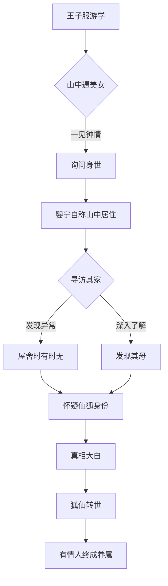
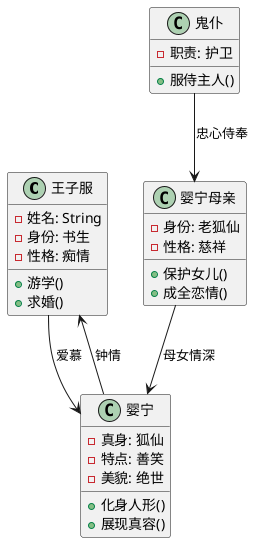

# 📖 妙言 Markdown 语法指南

*以《聊斋志异·婴宁》之美，展现 Markdown 之妙*

---

## 目录

- [标题格式](#标题格式)
- [文本格式](#文本格式)
- [列表](#列表)
- [链接与图片](#链接与图片)
- [表格](#表格)
- [代码](#代码)
- [数学公式](#数学公式)
- [图表 (Mermaid、PlantUML、Markmap)](#图表)
- [引用](#引用)
- [任务列表](#任务列表)
- [脚注](#脚注)
- [分隔线](#分隔线)

---

## 标题格式

# 第一回：奇遇山中花神女

## 王子服游于山中

### 忽见一女子，美貌异常

#### 女子巧笑倩兮，美目盼兮

##### 问其姓名，言为婴宁

###### 自此王子服心神不宁

---

## 文本格式

**王子服**游学期间，偶遇一位*绝色佳人*，名唤***婴宁***。此女子巧笑如花，令人心驰神往。

~~世人皆言狐仙魅惑~~，然婴宁之美，乃天然去雕饰。

婴宁善笑，终日不绝，其声如银铃般清脆。

王子服问道："姑娘家住何方？"婴宁答曰："`山中有舍，与母同居。`"

水分子为H~2~O，古人亦知水之重要。

这个故事发生在明朝万历年间，约16^世纪^末期。

---

## 列表

### 婴宁的奇异之处

- **外貌特征：**
  - 肌肤如雪 ❄️
  - 笑容如花 🌸
  - 眉目如画 🎨
    - 柳眉弯弯
    - 杏眼盈盈
  - 身姿婀娜 💃
  - 声音清脆如黄莺 🐦

### 故事发展顺序

1. **初次相遇**
   1. 王子服游学途中
   2. 山中偶遇婴宁
2. **相识相知**
3. **身世之谜**
   - 发现其为狐仙转世
   - 母亲亦非凡人
4. **终成眷属**

---

## 链接与图片

王子服的故事可参见[《聊斋志异》原文](https://zh.wikipedia.org/wiki/聊斋志异)。


更多蒲松龄作品请访问[古典文学网站](https://www.gushiwen.org)。

您也可以跳转到文档的其他章节，如[标题格式](#标题格式)。

---

## 表格

| 人物 | 身份 | 特点 | 名句 |
|------|------|------|------|
| **婴宁** | 狐仙 | 善笑如花 | "与君初相识，犹如故人归" |
| **王子服** | 书生 | 痴情专一 | "此情可待成追忆" |
| **婴宁之母** | 狐仙 | 慈祥睿智 | "有情人终成眷属" |
| **鬼仆** | 精怪 | 忠心护主 | "主人有命，奴不敢违" |

### 《聊斋志异》名篇一览

| 篇目 | 类型 | 评分 | 推荐度 |
|:-----|:----:|-----:|:-----:|
| 婴宁 | 狐仙 | 9.5分 | ⭐⭐⭐⭐⭐ |
| 倩女幽魂 | 鬼魂 | 9.8分 | ⭐⭐⭐⭐⭐ |
| 崂山道士 | 神怪 | 8.5分 | ⭐⭐⭐⭐ |
| 画皮 | 妖怪 | 9.0分 | ⭐⭐⭐⭐⭐ |

---

## 代码

### 古代诗词格律检测程序

```python
def check_poem_pattern(poem_lines):
    """
    检测古诗词的格律和韵脚
    """
    patterns = {
        "五言": 5,
        "七言": 7,
        "词": "不定长"
    }
    
    for line in poem_lines:
        char_count = len(line.replace("，", "").replace("。", ""))
        
        if char_count == 5:
            print(f"五言诗句：{line}")
        elif char_count == 7:
            print(f"七言诗句：{line}")
        else:
            print(f"词句或其他：{line}")
    
    return "格律检测完成"

# 婴宁诗句示例
poem = [
    "山中有美人兮，心悦君兮君不知",
    "美目盼兮巧笑倩，狐仙下凡入人间"
]

check_poem_pattern(poem)
```

蒲松龄在《聊斋志异》中写道：`性痴，则其志凝：故书痴者文必工，艺痴者技必良。`

---

## 数学公式

古代数学中的美学比例，如黄金分割：

$$\phi = \frac{1 + \sqrt{5}}{2} \approx 1.618$$

婴宁的美貌可用数学公式表达：
$Beauty = \lim_{time \to \infty} \frac{inner\_beauty}{outer\_beauty} = constant$

古人云："数学之美，在于：
$$\sum_{n=1}^{\infty} \frac{element_n}{time^n} = eternal\_beauty$$

---

## 图表

### 婴宁身世揭秘流程图



### 《聊斋志异》人物关系图



### 《聊斋志异·婴宁》思维导图

```markmap
# 聊斋志异·婴宁

## 主要人物
- **王子服**
  - 身份：书生
  - 性格：痴情专一
  - 命运：有情人终成眷属
- **婴宁**
  - 真身：狐仙转世
  - 特征：善笑如花
  - 性格：纯真烂漫
  - 美貌：绝世倾城
- **婴宁母亲**
  - 身份：老狐仙
  - 性格：慈祥睿智
  - 作用：成全恋情
- **鬼仆**
  - 职责：守护主人
  - 忠诚：至死不渝

## 故事脉络
- **初遇相识**
  - 山中偶遇
  - 一见钟情
  - 互生情愫
- **寻访探秘**
  - 寻找住所
  - 发现异常
  - 怀疑身份
- **真相大白**
  - 狐仙身份
  - 母女情深
  - 接受现实
- **喜结良缘**
  - 有情人终成眷属
  - 跨越种族界限

## 文学主题
- **爱情至上**
  - 超越世俗偏见
  - 真情感天动地
- **人性美好**
  - 善良纯真
  - 真诚待人
- **社会批判**
  - 反对门第观念
  - 提倡自由恋爱
- **浪漫主义**
  - 神话色彩
  - 理想化描绘

## 艺术价值
- **人物塑造**
  - 性格鲜明
  - 形象生动
- **情节构思**
  - 跌宕起伏
  - 引人入胜
- **语言艺术**
  - 简洁优美
  - 意境深远
```

---

## 引用

蒲松龄在《聊斋志异》序言中写道：

> 才非干宝，雅爱搜神；情类黄州，喜人谈鬼。
>
> 闻则命笔，遂以成编。久之，四方同人，又以邮筒相寄，
> 因而物以类聚。
>
> 于是积而为卷。

关于婴宁的性格描述：

> 婴宁曰："诺。"遂与俱归。女频频微笑。
>> 生问："何笑？"
>>> 女曰："我笑你痴耳。"

---

## 任务列表

### 《聊斋志异·婴宁》阅读清单

- [x] 初读原文，了解故事梗概
- [x] 分析人物性格特点
  - [x] 婴宁：善笑、纯真、痴情
  - [x] 王子服：痴情、执着、善良
- [x] 理解故事主题
- [ ] 对比其他狐仙故事
  - [x] 与《倩女幽魂》对比
  - [ ] 与《白蛇传》对比
  - [ ] 与《西厢记》对比
- [ ] 分析文学价值
- [x] 欣赏古典文学之美

---

## 脚注

《聊斋志异》[^1]是中国古典文学的瑰宝，其中《婴宁》一篇[^2]更是描绘了狐仙与书生的动人恋情。蒲松龄[^3]通过这些故事，展现了其对美好爱情的向往[^4]和对封建礼教的批判[^5]。

[^1]: 清代蒲松龄创作的文言短篇小说集  
[^2]: 全书491篇故事中最著名的篇章之一  
[^3]: 字留仙，号柳泉居士，清代文学家  
[^4]: 通过人狐恋表达对纯真爱情的赞美  
[^5]: 批判当时社会的虚伪和冷漠

---

## 分隔线

婴宁的故事分为几个重要阶段：

---

**第一阶段：初遇山中**
王子服游学途中，偶遇婴宁...

---

**第二阶段：情愫暗生**
两人相识相知，情意绵绵...

---

**第三阶段：身世之谜**
发现婴宁非凡人，乃狐仙转世...

---

## 表情符号与特殊字符

婴宁的情感表达：

😊 终日笑容满面，如春花绽放
😍 对王子服一见钟情  
🤔 对人世间的好奇与疑惑
😢 离别时的不舍眼泪
😴 安详沉睡的美丽
💕 真挚纯洁的爱情

### 古典标点符号

- 书名号：《聊斋志异》《婴宁》
- 省略号：王子服心想……
- 破折号：婴宁笑道——"公子好痴！"
- 版权符号：© 蒲松龄原著
- 箭头：现实 → 梦境 ← 仙境

---

*"情之所钟，正在我辈。"* —— 蒲松龄

**Markdown 语法演示完毕**

---

> 本文档以《聊斋志异·婴宁》的优美故事为载体，全面展示了妙言对 Markdown 语法的完整支持。从基础格式到高级功能如数学公式、流程图等，妙言助您轻松创作结构清晰、格式优美的文档。无论是学术论文、技术文档还是文学创作，妙言都是您的得力伙伴。

愿妙言伴您写出更多妙语佳文！✍️
