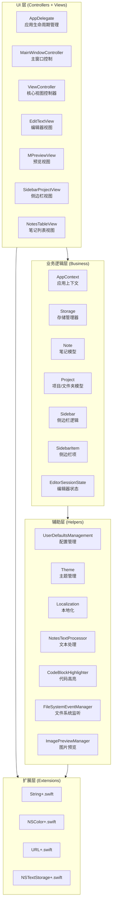
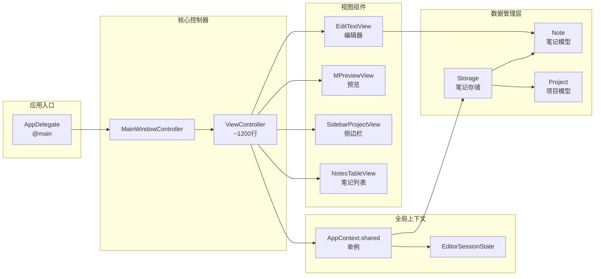
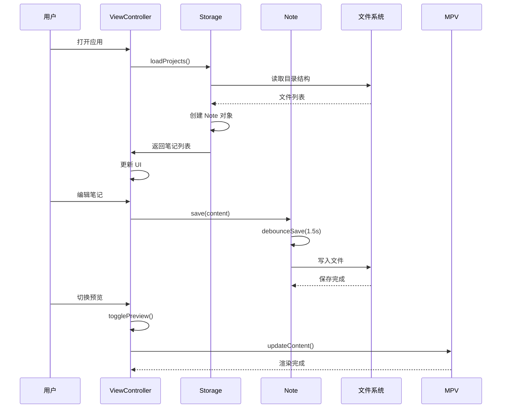
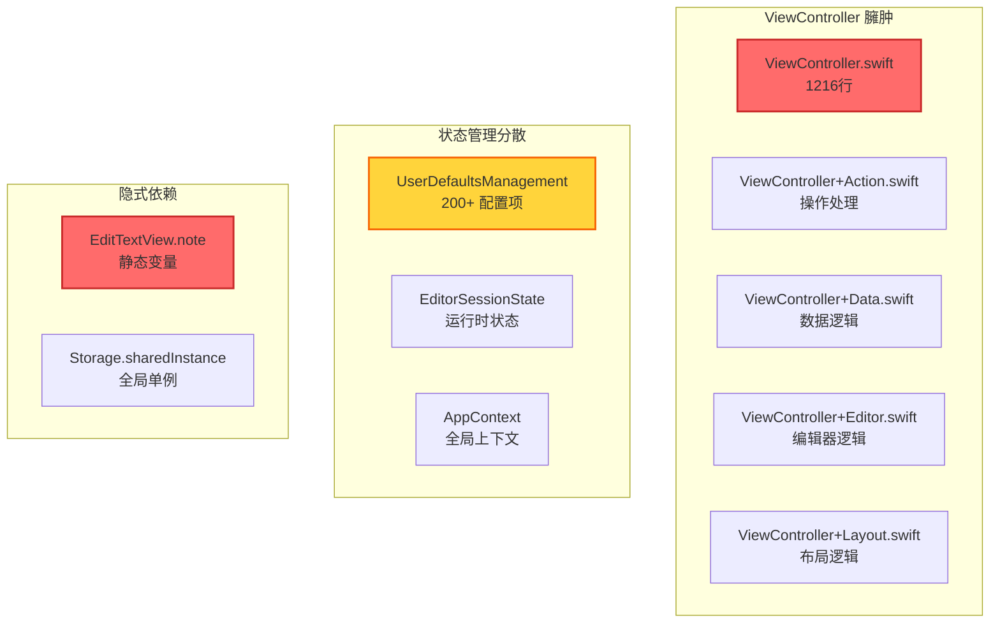
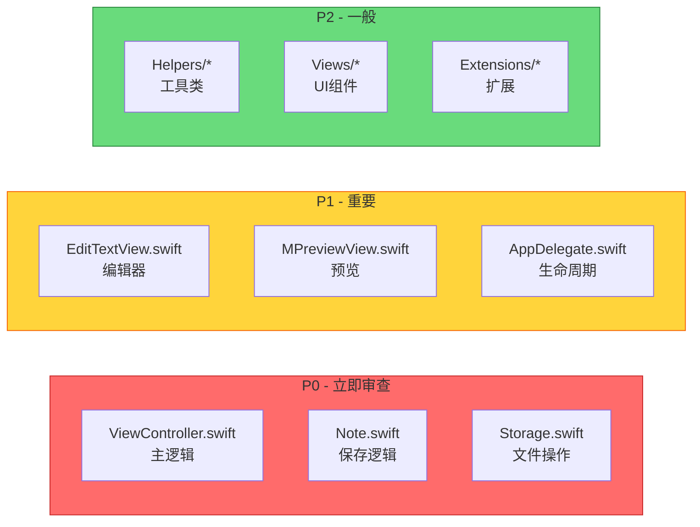
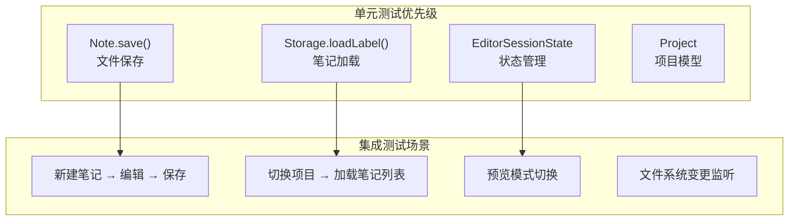

# MiaoYan 代码审查图谱

## 项目概览

**MiaoYan** 是一个基于 Swift 6 + AppKit 的 macOS Markdown 编辑器，采用本地优先的文件存储架构。

---

## 1. 架构分层图



---

## 2. 核心依赖关系图



---

## 3. 数据流图



---

## 4. 模块复杂度热力图

| 模块 | 文件数 | 代码行数 | 复杂度 | 风险等级 |
|------|--------|----------|--------|----------|
| **ViewController** | 5个扩展文件 | ~1500行 | 🔴 高 | 核心逻辑过于集中 |
| **EditTextView** | 1 | ~800行 | 🟡 中高 | 编辑器核心 |
| **Storage** | 1 | ~1100行 | 🟡 中高 | 文件管理逻辑复杂 |
| **Note** | 1 | ~980行 | 🟡 中 | 模型职责较多 |
| **Business** | 10 | ~2500行 | 🟢 中 | 相对均衡 |
| **Helpers** | 20+ | ~3000行 | 🟢 中 | 工具函数分散 |
| **Views** | 20+ | ~3500行 | 🟢 中 | UI组件较多 |

---

## 5. 关键问题识别

### 5.1 🚨 高风险区域



### 5.2 代码异味清单

| 问题 | 位置 | 影响 | 建议 |
|------|------|------|------|
| **静态变量依赖** | `EditTextView.note` | 全局状态难以测试 | 改为依赖注入 |
| **单例过度使用** | `Storage.sharedInstance()` | 紧耦合 | 考虑协议抽象 |
| **VC 职责过重** | `ViewController` 及扩展 | 维护困难 | 拆分为多个 Coordinator |
| **延期计算属性** | `Note.content` | 懒加载陷阱 | 明确加载时机 |
| **强制解包** | 多处 `!` 使用 | 潜在崩溃 | 使用 Optional 链 |

---

## 6. 推荐审查优先级



---

## 7. 测试覆盖建议



---

## 8. 架构改进建议

### 8.1 短期优化
1. **拆分 ViewController**: 将 Action/Data/Editor/Layout 逻辑拆分为独立 Coordinator
2. **统一状态管理**: 将分散在 UserDefaultsManagement 和 EditorSessionState 的状态合并
3. **消除静态变量**: 移除 `EditTextView.note` 等静态引用

### 8.2 中期重构
1. **引入 Repository 模式**: Storage 层抽象为协议，便于测试
2. **MVVM 迁移**: ViewController 减负，引入 ViewModel 层
3. **事件总线**: 使用 NotificationCenter 或 Combine 解耦组件通信

### 8.3 长期演进
1. **SwiftUI 迁移**: 逐步替换 AppKit 视图
2. **插件架构**: 支持扩展机制
3. **数据持久化**: Core Data 或 SwiftData 替代文件系统直接操作

---

## 9. 文件依赖矩阵

```
                    AppDelegate  ViewController  Storage  Note  Project  EditTextView
AppDelegate              -            ✅          ✅       -       -          -
ViewController            ✅           -           ✅      ✅      ✅         ✅
Storage                   -            ✅          -       ✅      ✅          -
Note                      -            ✅          ✅      -       ✅          ✅
Project                   -            ✅          ✅      ✅      -           -
EditTextView              -            ✅          -       ✅      -           -
```

---

*生成时间: 2026-03-19*
*版本: v1.0*
